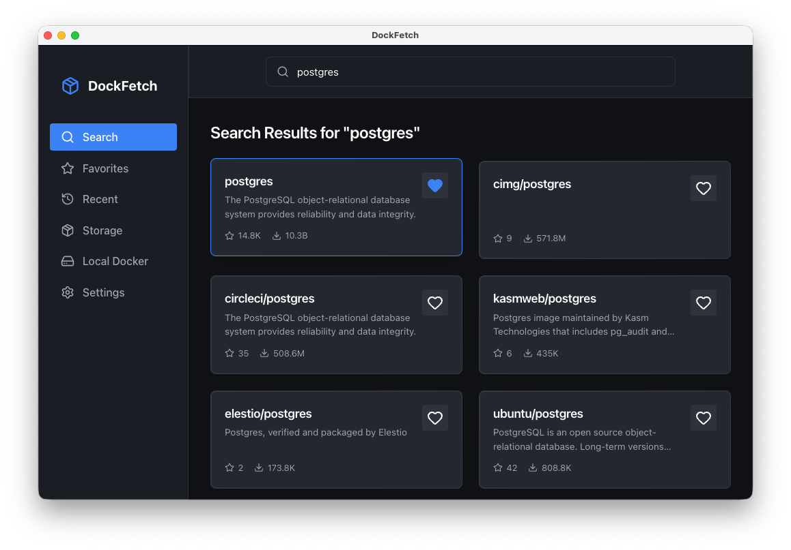
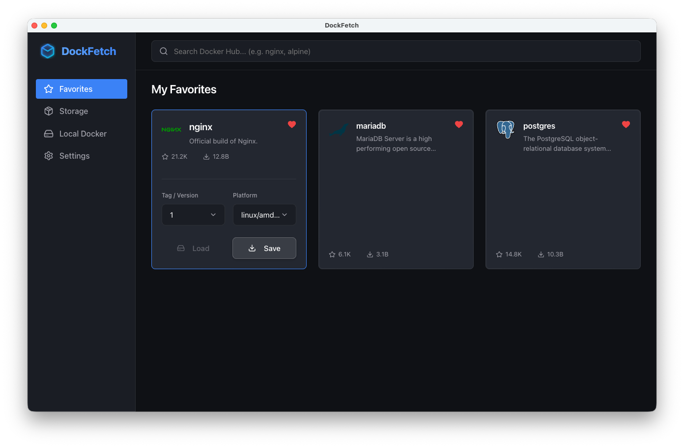
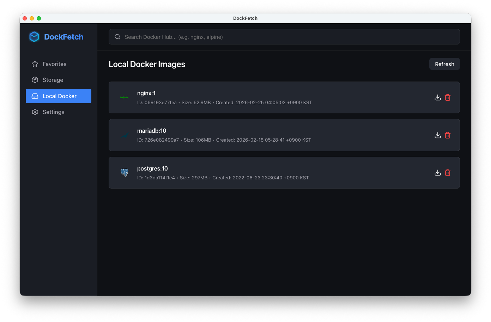

# 🐳 DockFetch

> **The easiest way to download Docker images as `.tar` files, directly to your desktop.**

**DockFetch** is a sleek, standalone desktop application built to solve one core problem: **downloading Docker images is too complicated.** 

Usually, extracting a Docker image requires running a bulky background daemon, typing out `docker pull`, waiting for it to load into a hidden virtual machine, and then manually running `docker save -o image.tar` just to get a single file. 

DockFetch completely skips that. Our app lets you explore the entire Docker Hub registry visually, pick the exact tag you need, and download the filesystem layers straight into a ready-to-use `.tar` file on your Mac or PC—**all without needing the Docker Desktop daemon running.**

---

## ✨ Why DockFetch?
- **No Daemon Required**: Directly fetches image layers via HTTP and packages them into standard `docker load`-ready `.tar` files locally.
- **Visual Registry Explorer**: Instantly search for images, browse available tags, filter by platform architecture, and check layer sizes before downloading.
- **Favorites & Storage Manager**: Bookmark the images you care about most, and manage your downloaded `.tar` files directly from a built-in clean UI.
- **One-Click Local Loading**: *If* you have Docker installed, you can beam your downloaded `.tar` files straight into your local daemon with a single click. No terminal required.
- **Export Existing Images**: Browse your local Docker images and instantly export them back out to `.tar` files for sharing or cold storage.

---

## 🚀 Getting Started

### ⚠️ macOS "App is damaged" Error (Gatekeeper)
Because this is an open-source tool without an Apple Developer certificate, macOS Gatekeeper may flag the downloaded `.dmg` or `.app` as "damaged".

**To bypass this:**
1. Open the `.dmg` and drag **DockFetch** into your `Applications` folder.
2. Open your terminal and run the following command to remove the quarantine flag:
   ```bash
   sudo xattr -cr /Applications/DockFetch.app
   ```
3. You can now open DockFetch normally from your Launchpad!

### Prerequisites
- [Node.js](https://nodejs.org/) (v16 or higher recommended for building)
- *(Optional)* Docker daemon for the "Local Docker" import/export features.

### Installation & Run Locally
```bash
# Clone the repository
git clone https://github.com/your-username/dock-fetch.git
cd dock-fetch

# Install dependencies
npm install

# Start the development server and Electron app
npm run dev
```

### Build for Production
DockFetch supports building executables for multiple operating systems out-of-the-box!

```bash
# Build for your current OS (Default)
npm run build

# Build specifically for macOS (.dmg, .zip)
npm run build:mac

# Build for Windows (.exe / NSIS)
npm run build:win

```bash
# Build for Linux (.AppImage, .deb)
npm run build:linux
```

## 📸 Screenshots

### 1. Search Overlay & Details
*Floating search results and inline registry tag exploration.*
<br>


### 2. Favorites List
*Track the images you rely on the most and manage download states.*
<br>


### 3. Local Docker Integration
*Instantly browse your local Docker environment and export active images seamlessly to physical `.tar` files.*
<br>


## 🛠 Tech Stack
- **Frontend**: React, Vite, Vanilla CSS, Lucide React Icons
- **Backend/App**: Electron, Node.js

## 📄 License
MIT License

